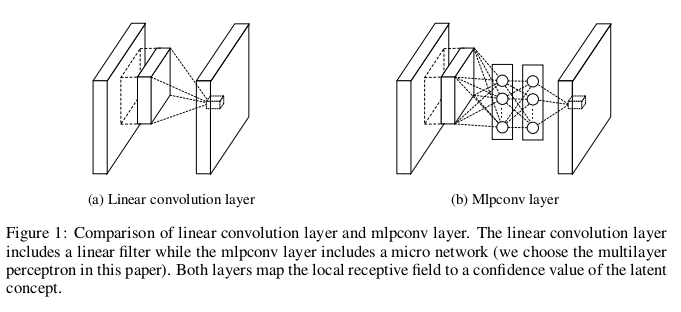
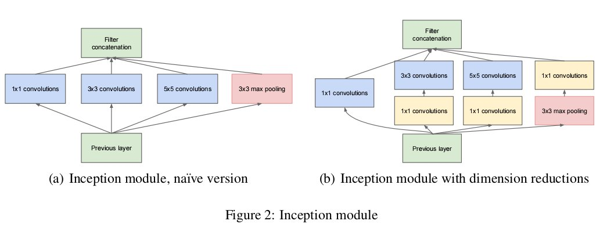
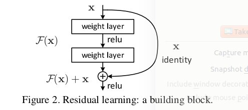
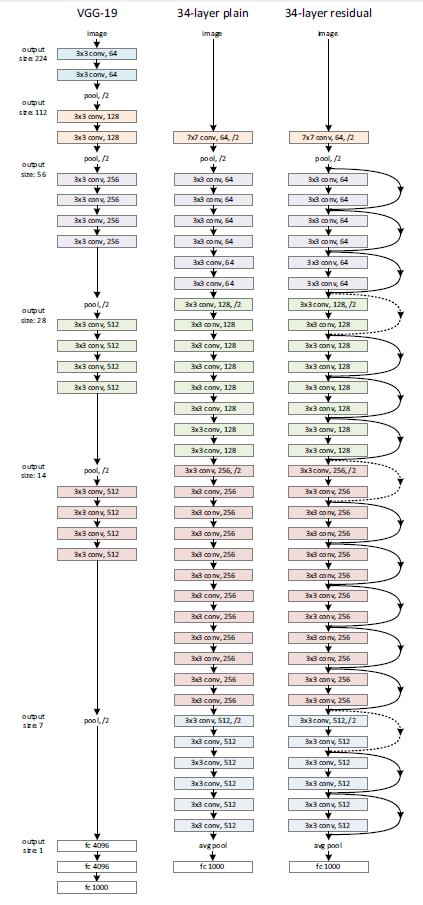
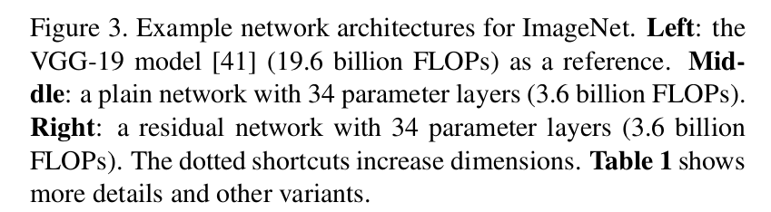

# tricks and tips
 collected for optimizing deeplearning models.

all images used is in directory:

    ./images
while all papers referred is in directory:

    ./papers

 **any fixes or advice is highly welcome, feel free to inform me <oukohou@outlook.com>.**

## 1. data augmentation.

- for images, do random crops, rotation, flip, color, blah blah....
- more generally, do upsampling, downsampling, so on.

## 2. class imbalance.
most of the time, the datasets classes will be imbalance, what to do?
- over-sample on minority classes several times, train less models.
- down-sample on majority classes many times, train more models.
- do no resample, instead generate new samples, such as [SMOTE](http://download.springer.com/static/pdf/448/bok%253A978-3-642-24958-7.pdf?originUrl=https%3A%2F%2Flink.springer.com%2Fbook%2F10.1007%2F978-3-642-24958-7&token2=exp=1506651779~acl=%2Fstatic%2Fpdf%2F448%2Fbok%25253A978-3-642-24958-7.pdf%3ForiginUrl%3Dhttps%253A%252F%252Flink.springer.com%252Fbook%252F10.1007%252F978-3-642-24958-7*~hmac=6dbf88c18d0d33f794e04534e1cdaa721a7a0bb108fb85a188a49b973af09aa4).
- adjust the weight of different classes, for instance, increase the weight of minority class.
- other ways to get more data: buy, demand, etc....

this is mainly based on this [blog](http://www.cnblogs.com/zhizhan/p/5821542.html), see for detail.

## 3. parameter adjustment.
how to choose the best params?
- most commonly used: grid search.
- according to experience: learning rate between 0.01-0.001, activation
 as Relu, convolution kernel of 3x3, so on.

remember to adjust parameters in contrast, always compare and find which
is better, never blindly add layers.

## 4. fine-tuning.
fine-tuning is mostly used for transfer learning.

what is fine-tuning?

to be simple, using pre-trained models to train your
own model is fine-tuning, for example, using pre-trained alexnet model or
Inception model as former layers of your own model.

of course, most time you should/will abandon some later layers of the pre-trained model.

this [blog](http://blog.csdn.net/zjucor/article/details/78033780) described quite well about fine-tuning issues, see for details.

*note: in case the blog link doesn't work, me myself copied it [here](https://app.yinxiang.com/Home.action#n=7d3cb9ed-1093-44c8-920d-7e8dcf69f10c&s=s64&ses=4&sh=2&sds=5&).*

## 5. other tricks.
### 1) batch normalization.
first proposed in [Batch Normalization: Accelerating Deep Network Training b
y Reducing Internal Covariate Shift](https://arxiv.org/abs/1502.03167) submitted on 11 Feb 2015(v1).

as the paper's title says, batch norm Accelerates Deep Network Training by Reducing Internal Covariate Shift.

### 2) 1x1 conv layer.

first proposed in [Network in Network](https://arxiv.org/abs/1312.4400) submitted on 16 Dec 2013(v1).

1x1 conv layer mainly used for two purposes:
- down or up sampling. this is for the reason that new generated maps will have
channels of the 1x1 conv layers, thus you can use it for down or up sampling.
- to enforce the "capability in modeling various distributions of latent concepts",
see following [googlenet](https://arxiv.org/pdf/1409.4842.pdf) for illustration:

### 3) global average pooling.
also proposed in [Network in Network](https://arxiv.org/abs/1312.4400) submitted on 16 Dec 2013(v1).
mainly used to replace the last Fully-Connected layers.

this will decrease params, actually pooling layer have no params to train,
what's more, this is also "more robust to spatial translations of the input".

### 4) Resnet.

first proposed in [Deep Residual Learning for Image Recognition](https://arxiv.org/pdf/1512.03385.pdf)
submitted on Dec 2015,first author is Kaiming He, remember this name,
you will hear it many times if you dive your head into deeplearning stuffs.

a building block of Resnet is like:

you can see more:

a translated version is [here](http://www.jianshu.com/p/f71ba99157c7),
but reading original paper, as is awlays said, is better.
see paper for more detail, Resnet is now actually base stone for many other networks.

## 6. other methods.
    to be continued.
this is all written according to my immediate memory, amything I later find or
recall will be added.

deeplearning is really broad and profound, too many to learn.
this is only a tip of an iceberg.

and again, **any fixes or advice is highly welcome, feel free to inform me <oukohou@outlook.com>.**

_**any star or fork is highly appreciated!**_